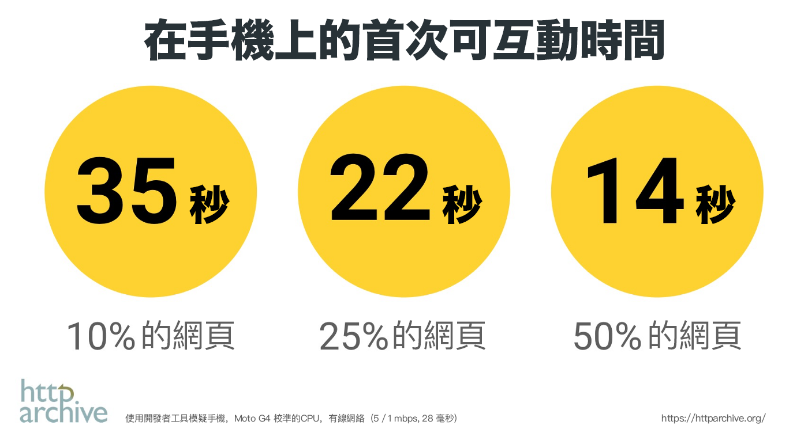
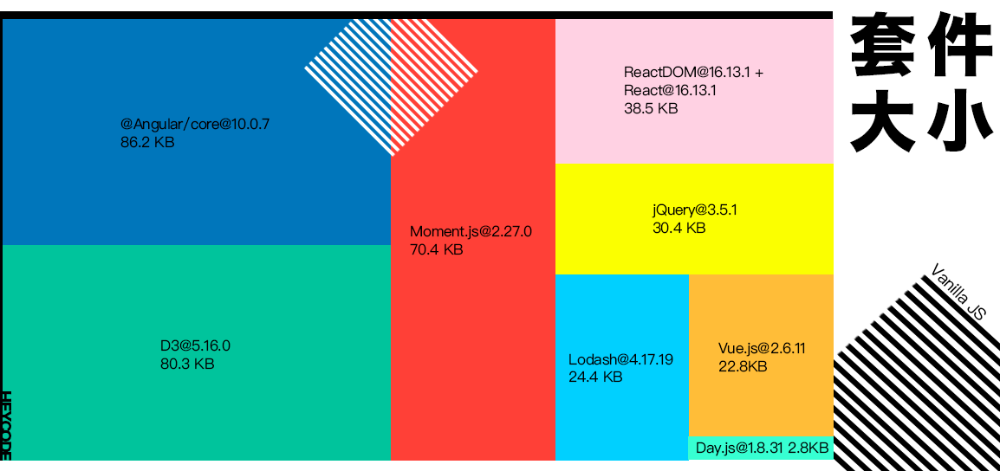
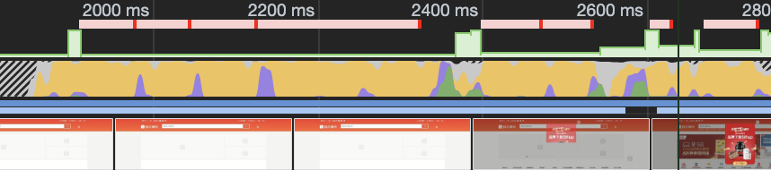
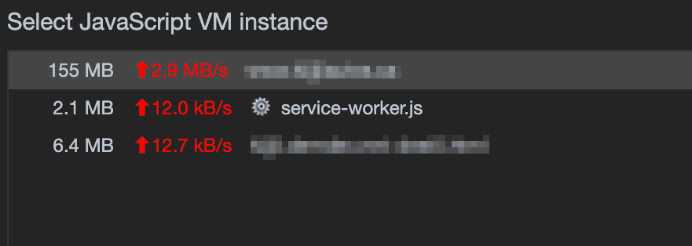

> 你要得到什麼，也必須付出同等代價的東西。

我們的網頁變得愈來愈依賴 Javascript，有時候我們卻忽略了使用它的代價。

## 色彩繽紛下的暗湧

由 1991 年誕生至今，網頁經歷了翻天覆地的變化。由一開始的純文本，演化到精美的頁面。直到現在，我們不難在網上找到類桌面應用的網頁。在網頁變得更互動的同時，JavaScript 的檔案大小也與日俱增。根據 HTTP Archive 的數據，手機上 JavaScript 的平均檔案大小是 ~500KB，50% 的網站需要 14 秒才可開始互動。這 14 秒能令你公司損失大量的潛在客戶。

<small style="color:rgba(0,0,0,0.5)">圖片由 The Cost of JavaScript in 2017 中翻釋</small>

另一方面，隨著 JavaScript 生態系統愈來愈豐富，前端工程師很容易墮入過量安裝套件的陷阱。以操作 DOM 為例：很多新手會過份依賴 jQuery，他們卻忽略了最好的函式庫已安裝在瀏覽器內 -- 原生 DOM API。

<small style="color:rgba(0,0,0,0.5)">jQuery 在經 Gzip 壓縮後還佔 30.4kB!</small>

大家或許心裡在想：網頁圖片的檔案也很大，為何我只針對 JavaScript。沒錯，單純以檔案的大小去比較，有些網頁的圖片總量比 JavasScript 還多。但若果在相同的檔案大小下，JavaScript 所消耗的資源遠比圖片多。(In general ~70% of website resources are images, forgot where it stated)

在了解詳細原因前，我們先一起去了解瀏覽器的基本運作。

## 忙碌的瀏覽器

當用戶進入網站時，瀏覽器就開始忙碌地工作起來。從瀏覽器的角度來看有點像這樣：

  

瀏覽器既要一邊下載網頁資源，又要進行畫面宣染，還要解析及執行 JavaScript。在 Chrome 的開發者工具中，大家可以看到黃色的部分是 JavaScript 的執行時間。至於代碼解析的工作，最新的 V8 能夠把它們分配到工作線程（worker threads）上並行執行，不阻礙主線程的運作；但非 V8 的瀏覽器就沒法享受這項優化。

<small style="color:rgba(0,0,0,0.5)">蝦皮購物網在開發者工具中的效能</small>

TODO JS VS IMAGE

現在我們知道執行 JavaScript 的代價遠比想像中高。究竟這會對用戶帶來甚麼的負面影響呢？

## 不能一心二用的主線程

主線程的工作主要有三個：宣染畫面、執行 Javascript、處理用戶輸入。很不幸地，主線程不能同時間執行這三項工作。當工作繁忙時，它只能把工作項目安排得一個緊接著下一個。我試舉一個例子：當主線程正在繁忙時，用戶在這時按下按鈕。因為主線程未能夠即時抽空去更新畫面，所以從用戶的角度來看就是：網頁沒有回應。

button no response gif

同樣的問題也會在開啟網頁時發生。在探討此問題前，讓我們先複習一下瀏覽器是如何開啟網頁。

## 開啟網頁之旅

在普通人眼中，開啟網頁只有空白和載入完成這兩個階段，而中間是沒有其他的步驟。實際上，開啟網頁是一個多階段的旅程。

這裏有兩個關鍵的時間點： 
**能夠看到**是指當用戶能在屏幕上看到內容的時間點。 
**能夠互動**是指當用戶能夠和網頁上元素互動的時間點。換句話說，瀏覽器這時已準備好快速回應用戶的輸入。

當載入網頁時，若果網頁有過多的 JavaScript 要執行，主線程未能抽空去回應用戶的輸入。用戶最終會落入看到但用不到的困境。

這問題普遍發生於現代框架（如 React）加上伺服器端宣染（Server Side Rendering，SSR）的架構。雖然網站得益於 SSR 而能夠快速完成繪製，但是前端的主線程因被加濕工作（Hydration）排得滿滿，最後導致用戶體驗很差。

## 其他問題

大量的 JavaScript 代碼，再加上編程不當的話，會導致網頁耗用大量的記憶體。而當記憶體快要耗盡時，瀏覽器為了回收記憶體。它會頻密地執行垃圾收集（Garbage Collection，GC），最後導致網頁卡鈍。

## 改善建議

礙於篇幅關係，我們今天不會在這裡詳細討論解決方法。取而代之，我會在下方簡略地列出三點：

- 只下載必需的 JavaScript
- 正確地使用 script 標籤
- 使用輕量級的函式庫

## 總結

到最後大家可能會問：究竟網頁有多少的 JavaScript 才叫合適的量？對不起，這裏沒有一個絕對的答案。只有最了解項目性質及用戶行為的大家才知道。... 但若果大家硬要知道一個絕對數值的話，你可以在頁腳裡找到臉書的連結，並搜尋「用戶體驗」。 << not good ending… :[

… mention next article … too tired… don’t wanna write anything

若果大家喜歡文章內容的話，請留下電子郵件。當有新發佈的文章及影片時，我會第一時間通知大家。你的支持及鼓勵是我源源不絕的動力！

## 參考資料

The Cost of JavaScript in 2017 
https://medium.com/dev-channel/the-cost-of-javascript-84009f51e99e 
The Cost of JavaScript in 2018 
https://medium.com/@addyosmani/the-cost-of-javascript-in-2018-7d8950fbb5d4 
The Cost of JavaScript in 2019 
https://v8.dev/blog/cost-of-javascript-2019
